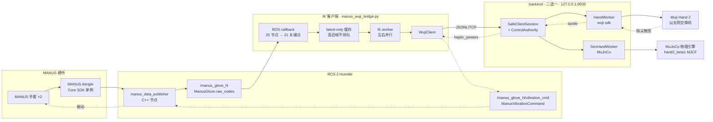
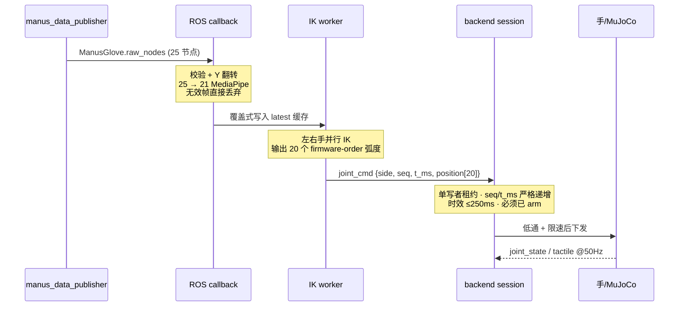
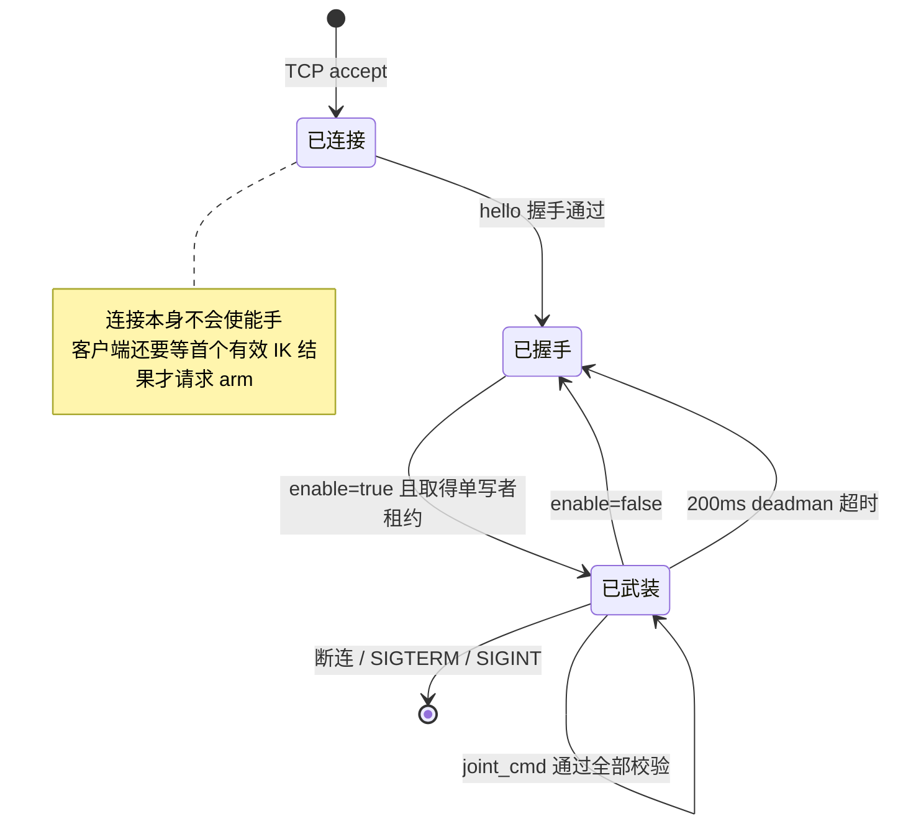

# 架构

MANUS 数据手套 → IK 重定向 → Wuji Hand 2（真机或 MuJoCo）。

真机和仿真共用**同一条 TCP 契约**和**同一套安全状态机**，因此仿真里验证过的控制语义在真机上逐字成立。

## 1. 总览



## 2. 进程与启动

三个进程，全部跑在同一台 x86 上，全部使用**同一个解释器**（conda base Python 3.10，由 `scripts/activate_base.sh` 统一选定为 `$TELEOP_PYTHON`）。

| 进程 | 启动命令 | 作用 |
|---|---|---|
| MuJoCo backend | `./scripts/start_sim.sh`（加 `HEADLESS=1` 关窗口） | 仿真手，监听 :9500 |
| 真机 backend | `./scripts/start_hand2_backend.sh` | wuji-sdk → 交换机 → Hand 2，监听 :9500 |
| IK 客户端 | `./scripts/start_manus_teleop.sh` | 拉起 `manus_data_publisher`，连 :9500 |

两个 backend **互斥**（都占 :9500）。MANUS Core SDK 是单例，`manus_data_publisher` 同时只能有一个。

无手套的端到端自检（自己拉起 sim，跑完自动清理）：

```bash
./scripts/run_ik_mujoco_smoke.sh
```

## 3. 正向数据流



关键设计点：

**ROS callback 只做转换和缓存**，IK 和 TCP 绝不在回调线程里跑，否则会阻塞 ROS executor。

**latest-only 而非队列**。新帧直接覆盖旧帧，`overwritten` 计数进状态日志。遥操作要的是最新姿态，不是补齐每一帧——排队只会累积延迟。

**无效帧丢弃，不降级为零位**。缺点、重复点、NaN/Inf、维度错误全部拒绝。发零位等于让手突然张开。

## 4. IK backend

```bash
./scripts/start_manus_teleop.sh                      # sdk，默认
RETARGET_BACKEND=sdk ./scripts/start_manus_teleop.sh
```

| | `sdk`（默认） | `retargeter` |
|---|---|---|
| 实现 | `wuji_sdk.RetargetSession.for_hand` | `wuji_retargeting.Retargeter.from_yaml` + Pinocchio |
| 输出顺序 | 已是 firmware order，**禁止再排** | Pinocchio qpos，需按 joint name 重排一次 |
| 实测延迟 | 平均 ~0.7 ms，峰值 ~2 ms | 平均 ~13 ms，冷启动峰值 ~210–255 ms |
| 固定 beta1 模型下 | 正常工作 | **fail-fast，拒绝启动** |

重排由 `joint_order.strict_joint_name_permutation` 按名字严格计算，名字对不上直接失败，**绝不 identity fallback**——顺序错了会让手做出完全错误的动作，静默兜底比崩溃危险得多。

### 为什么 `retargeter` 在 beta1 上被禁用

`hand2_beta1` 的五个 `*_mcp_flex` 关节原点相对官方 `hand2/body` 旋转了约 π，屈曲的正方向是反的。官方 `AdaptiveOptimizerAnalytical` 带着 `soft_min: 0.0` + `w_hyper: 1.0` 这组"禁止负角度"的生物力学先验，遇到反向约定时会把四个 MCP 关节全部推到 +π/2 上限并锁死。

实测（合成手 open→close 全程扫描，同一份配置只换模型）：

| 模型 | 零位移关节 | MCP 钉在 90° | MCP 跟随幅度 | 与输入相关性 |
|---|---|---|---|---|
| `hand2_beta1/body` | 7/20 | 4/4 | 0.0000 | — |
| `hand2/body` | 4/20 | 0/4 | 0.7759 | +0.947 |

这不是调参问题：`w_dir`、`mediapipe_rotation.x`、`lp_alpha`、`segment_scaling` 四项全部改成官方值后，钉死的关节数一个都没变。因此 `RetargeterBackend` 在检测到该模型代次时直接抛错，而不是静默输出错误动作。

> 注意 `retargeter` 的冷启动峰值超过 200 ms 的 deadman，靠"拿到首个有效 IK 结果之后才 arm"规避。`sdk` 没有这个问题。

## 5. 安全状态机

`ControlAuthority`（`bridge/wuji_manus_bridge/control.py`）被真机和仿真**共用**。



七道闸门：

1. **TCP 连上不等于使能** — 必须显式 `enable`，客户端还要等第一个有效 IK 结果才发。
2. **单写者租约** — 全 server 只有一个控制客户端，第二个拿到 `control_busy`。
3. **重放防护** — `seq` 和 `t_ms` 都必须严格递增。
4. **时效检查** — 命令超过 250 ms 或来自未来 >1 s 一律拒绝。
5. **命令 deadman** — 200 ms（可配 100–250）没有新命令就 disable。
6. **独立看门狗线程** — `wuji-deadman-watchdog` / `sim-deadman-watchdog`，25 ms 周期，`daemon=False`。**不依赖任何客户端线程**，客户端卡死也能超时。
7. **退出必 disable** — `atexit` + SIGINT + SIGTERM 都接到 `shutdown()`。

命令必须恰好 20 个有限 JSON number，布尔和字符串会被拒绝。

### SDK 阻塞 I/O 不持锁

`HandWorker._tick` 先在锁内取状态快照，**释放锁之后**才调 `hand.enable()` / `disable()` / `publisher.send()`。这条很关键：一次卡死的 SDK 调用如果持着锁，会连锁冻结 `ControlAuthority`，让 deadman 永远无法触发。enable 失败会回滚，enable 期间收到 disable 请求会在完成后立即补一次 disable。

## 6. 线程模型

| 线程 | 所在进程 | 职责 |
|---|---|---|
| ROS executor | IK 客户端 | 只做校验、坐标转换、写缓存 |
| `manus-retarget` | IK 客户端 | 取 latest 帧，派发左右 IK |
| `ik` ×2 | IK 客户端 | 左右手并行求解 |
| `client-{addr}` | backend | 每客户端一个，收发 JSONL |
| `*-deadman-watchdog` | backend | 25 ms 独立超时检查 |
| `wuji-ctrl-{side}` / `sim-ctrl-{side}` | backend | 100 Hz 控制环；SDK publisher 的创建/发送/关闭全部归属此线程 |
| `mujoco-sim` | 仿真 backend | 物理步进 |

## 7. 关节顺序

20 个关节，finger-major，弧度，`index = finger*4 + joint`：

| index | 手指 | 关节 |
|---|---|---|
| 0–3 | thumb | cmc_flex, cmc_abd, mcp, ip |
| 4–7 | index | mcp_flex, mcp_abd, pip, dip |
| 8–11 | middle | mcp_flex, mcp_abd, pip, dip |
| 12–15 | ring | mcp_flex, mcp_abd, pip, dip |
| 16–19 | pinky | mcp_flex, mcp_abd, pip, dip |

这个顺序同时是 TCP 协议顺序、Hand 2 固件顺序和 MJCF actuator 顺序。启动时会逐一按名字校验，任一环节对不上就拒绝启动。详见 [docs/JOINT_LAYOUT.md](./docs/JOINT_LAYOUT.md)。

## 8. 模型固定

IK 的 URDF 和 MuJoCo 的 MJCF 必须来自**同一个 checkout 的同一个 commit**：

```text
${WUJI_DESCRIPTION_ROOT:-deps/wuji-description}
  commit 8271644a78d69ed9a4adcf9165d882c64ad33dfa  (v2026.8.3)
  hand2/hand2_beta1/body/{urdf,mjcf}/{left,right}.*
```

启动时校验：commit 精确匹配、是 checkout root、模型目录无 tracked 修改、不是符号链接、配置里的 URDF/MJCF 路径解析后与之一致。混用 Hand 1 或其他 Hand 2 代际会直接失败——IK 和仿真用不同模型算出来的结果没有可比性。

## 9. 环境

**单一解释器**：conda base Python 3.10。`scripts/activate_base.sh` 是唯一的选择点，所有脚本用绝对路径 `"${TELEOP_PYTHON}"` 调用它。

这样设计是因为 `manus_wuji_bridge.py` 必须在同一进程里同时拿到 `rclpy`（ROS 回调）和 `wuji_retargeting`（IK）。`rclpy` 无法 pip 安装，所以只能让解释器版本对齐 ROS Humble 的 3.10，再把其余依赖装进去。

脚本还做了两件事：`PYTHONNOUSERSITE=1` 屏蔽 `~/.local` 里可能存在的旧版包；sourcing ROS `setup.bash` 前后保存/恢复 `set -u`（ROS 的 setup 脚本不是 nounset-safe）。

```text
wuji-retargeting  2026.8.3   (editable)
wuji-sdk          2026.8.3
mujoco            3.11.0
ROS 2             Humble
```

## 10. 相关文档

- [README.md](./README.md) — 快速上手
- [docs/SIM_TELEOP.md](./docs/SIM_TELEOP.md) — **MANUS + MuJoCo 双终端运行指南（已验证）**
- [CURSOR_DEPLOY.md](./CURSOR_DEPLOY.md) — 部署与排错
- [docs/JOINT_LAYOUT.md](./docs/JOINT_LAYOUT.md) — 关节顺序细节
- [bridge/protocol/schema.md](./bridge/protocol/schema.md) — TCP 消息格式
